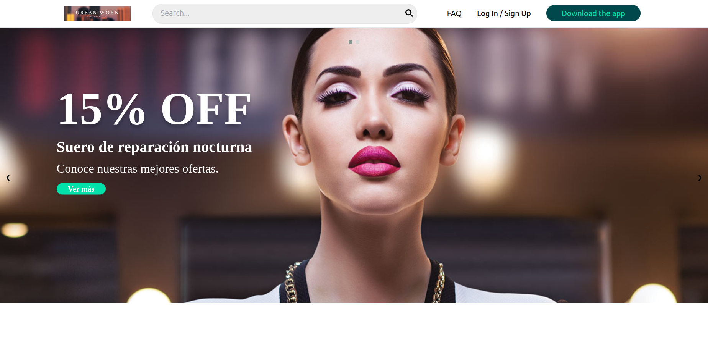

# Urban Worn — Ecommerce Demo

A Create React App beauty & personal-care ecommerce demo for practicing everyday React patterns: components, Context, controlled forms, list rendering, URL search params, and client-side routing.

No backend is required. Cart, auth session, and last order are stored in the browser with `localStorage`.



## Features

| Area | What it demonstrates |
| --- | --- |
| **Hero slider** | Custom React carousel (autoplay, fade, dots/arrows, pause on hover) |
| **Category menu** | Sticky header category links + home pills, synced via `?category=` |
| **Search** | Live suggestions (open product pages), submit filters via `?q=` |
| **Product catalog** | Multi-category products, real images, add-to-cart |
| **Product detail** | `/product/:id` with qty, add to bag, related products |
| **Cart** | Shared Context state, qty steppers, remove, summary |
| **Checkout** | Contact + pickup/delivery + pay on delivery / demo card |
| **Order confirmation** | Persisted last order + success UI |
| **Login / Sign up** | Auth forms only — local session, **no database insert** |
| **Download app** | Demo store buttons (no real store redirect) |
| **404** | Catch-all route for unknown URLs |
| **Contact / FAQ / Newsletter** | Controlled forms and headless accordion |
| **Header / Footer** | Working routes, cart badge, mobile menu, hash scroll |

## Routes

| Path | Page |
| --- | --- |
| `/` | Home (slider, categories, products) |
| `/product/:id` | Product detail |
| `/cart` | Shopping bag |
| `/checkout` | Checkout form |
| `/order-confirmation` | Order confirmation |
| `/login` | Log in (form only) |
| `/signup` | Sign up (form only, no DB) |
| `/download` | Download the app |
| `/faq` | FAQ |
| `/contact` | Contact |
| `*` | 404 Not found |

Category and search URLs on home:

- `/?category=skincare#products-title`
- `/?q=serum#products-title`

## Auth (demo only)

- Forms validate in the browser and set a local session (`urban-worn-auth-user`).
- Name and email are kept in `localStorage`. **Passwords are not stored.**
- There is **no API and no database insert**.

## Cart and checkout

- Cart: `CartProvider` → `localStorage` key `urban-worn-cart`
- Last order: `urban-worn-last-order` after a successful checkout
- Checkout is a demo flow — no real payments
- Pickup points and delivery fee: `src/data/catalog.js`

## Getting started

```bash
npm install
npm start
```

Open [http://localhost:3000](http://localhost:3000).

```bash
npm run build   # production build → build/
npm test        # Jest + React Testing Library
```

## Tech stack

- React 18
- React Router DOM v6
- Tailwind CSS (utility classes where used)
- Font Awesome
- react-headless-accordion

## Project structure

```text
src/
  components/     # Pages & UI (Home, ProductDetail, Cart, Auth, Header, …)
  context/        # AuthProvider, CartProvider
  data/catalog.js # Categories, products, pickup points, benefits
  utils/          # cart helpers, search helpers
  styles/         # Header, slider, home, product, cart, auth, contact, footer
  assets/         # logo.svg, hero banners, products/
  App.jsx         # Providers + router + ScrollToHash
```

## Notes

- Brand colors: teal `#01484C`, mint `#00E2A9`
- Logo: `src/assets/logo.svg`
- Product photos: `src/assets/products/` (Unsplash)
